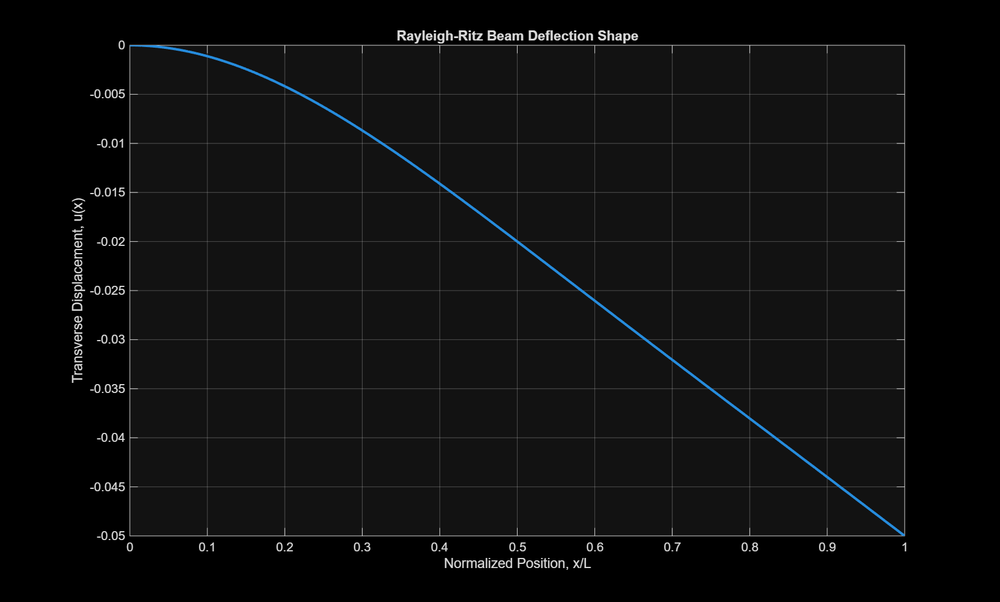

# rayleigh-ritz-beam-deflection
## Overview
Energy-based beam deflection approximation using the Rayleigh-Ritz method and a sixth-order polynomial trial function.

## Problem Description
A long, thin beam is fixed at the left end. Two prescribed transverse displacements are applied:

- $u_1$ at $x = L/2$
- $u_2$ at $x = L$

The objective is to determine an approximate displacement field \( u(x) \) using the Rayleigh-Ritz method.

## Method
A sixth-order polynomial trial function is assumed:

```math
u(x) = a_0 + a_1x + a_2x^2 + a_3x^3 + a_4x^4 + a_5x^5 + a_6x^6

## Displacement Plot

The plot below shows the Rayleigh-Ritz beam deflection shape for sample prescribed displacements.


